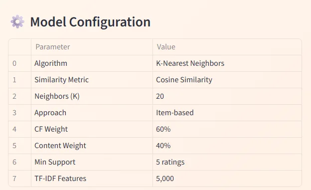

<p align="center">
  
</p>

<h1 align="center">Book Recommendation System</h1>

<p align="center">
  A Python project for loading Goodreads-style book data, preprocessing text features, building KNN-based recommenders, and evaluating recommendation quality.
</p>

<p align="center">
  <a href="#overview">Overview</a> ·
  <a href="#features">Features</a> ·
  <a href="#installation">Installation</a> ·
  <a href="#usage">Usage</a> ·
  <a href="#streamlit-demo">Streamlit Demo</a> ·
  <a href="#project-structure">Project Structure</a> ·
  <a href="#testing">Testing</a>
</p>

## Overview

This repository contains a small recommendation pipeline built around K-Nearest Neighbors and supporting utilities for:

- loading and validating book/rating datasets
- cleaning and preprocessing book metadata
- extracting text and numeric features
- generating recommendations with KNN and hybrid recommenders
- evaluating results with ranking metrics
- exploring the data with plots and a Streamlit demo

The code is organized as a reusable Python package under `src/`, with a notebook for analysis and a separate demo app in `demo/`.

## Features

- `DataLoader` and `GoodreadsLoader` for CSV, JSON, and gzipped JSON sources
- `BookPreprocessor` for cleaning and normalizing book metadata
- `FeatureExtractor` for TF-IDF, count, and combined text features
- `KNNRecommender` and `HybridRecommender` for recommendations
- `MetricsCalculator` and `RecommenderEvaluator` for Precision@K, Recall@K, NDCG, Hit Rate, MAP, coverage, and more
- `visualization.py` helpers for rating, activity, and model comparison plots
- `demo/app.py` Streamlit UI for interactive exploration

## Installation

```bash
git clone https://github.com/OuyangXuelili/Book-Recommendation-System.git
cd book-recommendation-system

python -m venv .venv
.venv\Scripts\activate

pip install -e .
```

For development and demo dependencies:

```bash
pip install -e ".[dev,demo,notebook]"
```

## Usage

### Load data

```python
from src.data_loader import GoodreadsLoader

loader = GoodreadsLoader(data_dir="data")
books_df, ratings_df = loader.load_dataset()
print(loader.compute_statistics(books_df, ratings_df).summary())
```

### Build recommendations

```python
from src.recommender import KNNRecommender

model = KNNRecommender(n_neighbors=20, metric="cosine", approach="item")
model.fit(ratings_df, books_df)

recommendations = model.recommend_for_user("user_123", n_recommendations=10)
for rec in recommendations:
    print(rec.title, rec.score)
```

### Preprocess text features

```python
from src.preprocessor import BookPreprocessor, FeatureExtractor

preprocessor = BookPreprocessor()
clean_books = preprocessor.fit_transform(books_df)

extractor = FeatureExtractor(method="tfidf", max_features=5000)
features = extractor.fit_transform(clean_books["title"])
```

## Streamlit Demo

Run the interactive demo locally with:

```bash
streamlit run demo/app.py
```

## Project Structure

```text
book-recommendation-system/
├── config/            # YAML configuration
├── data/              # Dataset notes and local data files
├── demo/              # Streamlit demo app
├── notebooks/         # Analysis notebook
├── src/               # Library code
├── tests/             # Pytest suite
├── README.md
├── requirements.txt
├── setup.py
└── pyproject.toml
```

## Testing

```bash
pytest tests/ -v
```

## Configuration

Project settings live in [config/config.yaml](config/config.yaml). The package metadata and dependency groups are defined in [pyproject.toml](pyproject.toml) and [setup.py](setup.py).

## Data

The repository is set up for Goodreads-style book and ratings data. See [data/README.md](data/README.md) for expected file names and download notes.

## Notes

- The repo is intentionally kept lightweight: code, configuration, tests, and demo UI are separated.
- The README focuses on what actually exists in this project instead of benchmark claims or generic marketing copy.
- If you add new features or plots, update the relevant section here at the same time.

## 📦 Installation

### Prerequisites

```bash
Python >= 3.8
pip >= 21.0
```

### Quick Start

```bash
# Clone the repository
git clone https://github.com/tharun-ship-it/book-recommendation-system.git
cd book-recommendation-system

# Create virtual environment (recommended)
python -m venv venv
source venv/bin/activate  # On Windows: venv\Scripts\activate

# Install dependencies
pip install -r requirements.txt

# Install package in development mode
pip install -e .
```

---

## 🔧 Quick Start

### Python API

```python
from src.recommender import BookRecommender
from src.data_loader import DataLoader

# Load the book dataset
books_df, ratings_df = DataLoader.load_goodreads_sample()

# Initialize recommender
recommender = BookRecommender(
    algorithm='hybrid',
    n_neighbors=20,
    cf_weight=0.6,
    content_weight=0.4
)

# Fit the model
recommender.fit(books_df, ratings_df)

# Get recommendations for a user
user_id = "Emma Thompson"
recommendations = recommender.recommend(user_id, n=10)

for book in recommendations:
    print(f"{book['title']} - Score: {book['score']:.2%}")
```

### Mood-Based Recommendations

```python
# Get recommendations by reading mood
mood = "🌟 Adventurous"
mood_recs = recommender.recommend_by_mood(mood, n=10)

for book in mood_recs:
    print(f"📚 {book['title']} by {book['author']}")
    print(f"   Genre: {book['genre']} | Rating: {book['rating']:.2f}⭐")
```

### Find Similar Books

```python
# Find books similar to a given title
similar = recommender.find_similar("Harry Potter and the Sorcerer's Stone", n=10)

print("Books similar to Harry Potter:")
for book in similar:
    print(f"  → {book['title']} ({book['similarity']:.2%} match)")
```

---

## 🛠 Technologies

| Technology | Purpose |
|------------|---------|
|  | Core framework |
|  | KNN & ML algorithms |
|  | Data manipulation |
|  | Numerical computing |
|  | Sparse matrices & similarity |
|  | Interactive visualizations |
|  | Web demo |

---

## 📚 Documentation

### ⚙️ Model Configuration

<p align="center">
  
</p>

### Configuration File

All pipeline settings are controlled via `config/config.yaml`:

```yaml
model:
  algorithm: "hybrid"
  n_neighbors: 20
  similarity_metric: "cosine"

hybrid:
  cf_weight: 0.6
  content_weight: 0.4

collaborative_filtering:
  approach: "item_based"
  min_support: 5

content_based:
  features: ["genre", "author", "year"]
  tfidf_max_features: 5000

evaluation:
  test_size: 0.2
  metrics: ["precision", "recall", "ndcg", "hit_rate", "coverage"]
  k_values: [5, 10, 20]
```

### API Reference

| Class | Description |
|-------|-------------|
| `BookRecommender` | Main recommendation engine with hybrid approach |
| `CollaborativeFilter` | User-based and item-based collaborative filtering |
| `ContentBasedFilter` | Genre, author, and metadata matching |
| `HybridModel` | Combines CF and content-based scores |
| `DataLoader` | Dataset loading and preprocessing |
| `Evaluator` | Metrics calculation and model comparison |

---

## 🧪 Testing

Run the comprehensive test suite:

```bash
# Run all tests
pytest tests/ -v

# Run with coverage report
pytest tests/ --cov=src --cov-report=html

# Run specific test file
pytest tests/test_recommender.py -v
```

---

## 🗺 Future Work

- [ ] Add deep learning models (Neural Collaborative Filtering)
- [ ] Implement matrix factorization (SVD, ALS)
- [ ] Real-time API endpoint with FastAPI
- [ ] Add user authentication and persistent profiles
- [ ] Integrate with Goodreads API for live data
- [ ] Docker containerization
- [ ] A/B testing framework for recommendation strategies

---

## 🤝 Contributing

Contributions are welcome! Please feel free to submit a Pull Request.

```bash
# Fork and clone
git clone https://github.com/YOUR_USERNAME/book-recommendation-system.git

# Create branch
git checkout -b feature/amazing-feature

# Commit and push
git commit -m 'Add amazing feature'
git push origin feature/amazing-feature

# Open Pull Request
```

---

## 📄 License

This project is licensed under the MIT License—see the [LICENSE](LICENSE) file for details.

---

## 🙏 Acknowledgments

- [UCSD Book Graph](https://sites.google.com/eng.ucsd.edu/ucsdbookgraph/home) for the Goodreads dataset
- [Scikit-Learn](https://scikit-learn.org/) for machine learning algorithms
- [Streamlit](https://streamlit.io/) for the interactive web demo
- [Plotly](https://plotly.com/) for beautiful visualizations

---

## 👤 Author

**Tharun Ponnam**

* GitHub: [@tharun-ship-it](https://github.com/tharun-ship-it)
* Email: tharunponnam007@gmail.com

---

**⭐ If you find this project useful, please consider giving it a star!**

* [🔗 Live Demo](https://knn-book-recommendation-system.streamlit.app)
* [🐛 Report Bug](https://github.com/tharun-ship-it/book-recommendation-system/issues)
* [✨ Request Feature](https://github.com/tharun-ship-it/book-recommendation-system/pulls)
